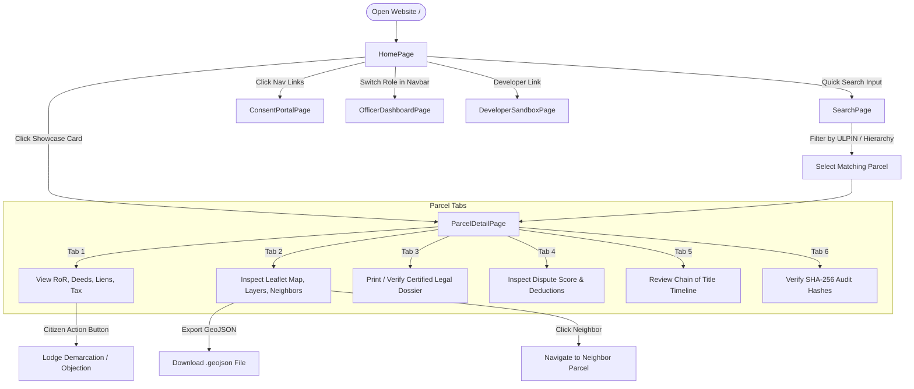

# NLIP — National Land Intelligence Platform
## Complete Technical Breakdown & System Overview

> **Current Implementation Reference Document**  
> *Prepared for engineering and evaluation team sharing.*  
> *Repository root:* `g:\frame`

---

## 1. Pages and Screens

The frontend routing in [`Frontend/src/App.tsx`](file:///g:/frame/Frontend/src/App.tsx) defines **6 core pages** (plus a 404 handler), wrapped inside a common navigation [`Shell`](file:///g:/frame/Frontend/src/components/layout/Shell.tsx):

| Route | Page Component | File Path | Primary Purpose |
| :--- | :--- | :--- | :--- |
| `/` | `HomePage` | [`Home.tsx`](file:///g:/frame/Frontend/src/pages/Home.tsx) | National landing page explaining the platform vision (SIH PS #26014), quick-search bar, trust indicators, and 4 sandbox parcel cards showcasing different legal/GIS scenarios. |
| `/search` | `SearchPage` | [`Search.tsx`](file:///g:/frame/Frontend/src/pages/Search.tsx) | Registry discovery portal with dual modes: **Quick Search** (text search across ULPIN, survey no., khasra) and **Hierarchical Search** (State → District → Village cascade). |
| `/parcel/:ulpin` | `ParcelDetailPage` | [`ParcelDetail.tsx`](file:///g:/frame/Frontend/src/pages/ParcelDetail.tsx) | The centerpiece 360° land dossier containing 6 deep-dive sub-screens managed via URL hash tabs (`#overview`, `#gis`, `#dossier`, `#intelligence`, `#history`, `#data-sources`). |
| `/consents` | `ConsentPortalPage` | [`ConsentPortal.tsx`](file:///g:/frame/Frontend/src/pages/ConsentPortal.tsx) | DPDP Act 2023 & DEPA consent management dashboard. Allows citizens to approve/revoke bank access tokens and allows lending officers to request time-boxed, purpose-bound permissions. |
| `/officer-dashboard` | `OfficerDashboardPage` | [`OfficerDashboard.tsx`](file:///g:/frame/Frontend/src/pages/OfficerDashboard.tsx) | Revenue & planning officer verification dashboard for reviewing satellite/drone change detection alerts and resolving citizen boundary/title grievances. |
| `/dev-sandbox` | `DeveloperSandboxPage` | [`DeveloperSandbox.tsx`](file:///g:/frame/Frontend/src/pages/DeveloperSandbox.tsx) | B2B / GovTech developer portal for generating scoped API keys, live testing endpoints in an interactive API playground, and viewing telemetry quotas. |
| `*` | `NotFoundPage` | [`NotFound.tsx`](file:///g:/frame/Frontend/src/pages/NotFound.tsx) | 404 error fallback with a link back to Home or Search. |

---

## 2. Features and Functionality

### 2.1 Global / Navigation Features
- **Demo Role Switcher**: A dropdown in the [`Navbar`](file:///g:/frame/Frontend/src/components/layout/Navbar.tsx) allows 1-click switching between pre-configured seed user personas:
  - *Citizen (UP)*: `Arjun Sharma`
  - *Revenue Officer (KA)*: `Ravi Kumar`
  - *Bank Official (MH)*: `Priya Nair`
  - *Developer API Partner*: `Dev Portal User`
  This updates [`useSessionStore.ts`](file:///g:/frame/Frontend/src/store/useSessionStore.ts) and conditionally reveals officer and developer links in the navigation bar.
- **Language Switcher (i18n)**: Toggle button in the navbar switching between **English** and **Hindi (हिन्दी)** using `react-i18next` ([`i18n/index.ts`](file:///g:/frame/Frontend/src/i18n/index.ts)).

### 2.2 Search & Discovery ([`Search.tsx`](file:///g:/frame/Frontend/src/pages/Search.tsx))
- **Quick Search**: Search input filtering by ULPIN (Bhu-Aadhaar), Survey Number, or Khasra Number, with an optional State dropdown filter.
- **Hierarchical Search**: 3-tier dropdown selection (State → District → Village) that narrows down parcels geographically.
- **Results List**: Displays match count, parcel ULPIN, location pills, land-use tags, and recorded vs. GIS area.

### 2.3 360° Parcel Detail & Dossier ([`ParcelDetail.tsx`](file:///g:/frame/Frontend/src/pages/ParcelDetail.tsx))
- **Sticky Context Sub-bar**: Stays fixed at top displaying:
  - Active parcel ULPIN, village, district, state.
  - Live **Area Variance Badge** (pulsing amber warning if GIS area deviates > 2% from revenue records).
  - Live **Encumbrance Warning Badge** (red pill showing active count).
  - **Export GeoJSON button**: Generates and downloads a valid `.geojson` file (`{ulpin}-cadastral.geojson`) containing boundary coordinates and cadastral attributes.
  - **Share Link button**: Copies current deep-link to clipboard with visual confirmation.
  - **Redirect to Location ↗**: Opens external Google Maps centered on the parcel centroid GPS coordinates.
  - **Change Parcel button**: Returns to the registry search page.
- **Tab 1: Parcel Overview (`#overview`)**:
  - Top metric stat cards: Bhu-Aadhaar Key, Recorded vs. GIS Area, Land Use Classification, Survey/Khasra/Patta references.
  - Record of Rights (RoR / Khatauni) table: Owner name, ownership type (sole/joint), share percentage, tenure type, validity.
  - Encumbrance & Mortgage register: Liens, lending institution, loan amount, validity dates.
  - Registered Title Deeds: Sub-Registrar Office (SRO) name, deed type, volume reference, consideration amount.
  - Municipal Tax Clearances: Financial year, assessment value, tax paid vs. pending balance.
  - Building & Town Planning sanctions: Approval status, permissible vs. built FAR, floor count.
- **Tab 2: GIS & Drone Map (`#gis`)**:
  - Full Leaflet cadastral map view ([`MapView.tsx`](file:///g:/frame/Frontend/src/components/map/MapView.tsx)).
  - Switchable Street Map (OSM) vs. High-Res Satellite Imagery (Esri World Imagery).
  - Layer overlay toggles for Master Plan Zones and Utility Infrastructure.
  - Centroid coordinates display with direct GPS redirect.
  - Interactive contiguous neighboring parcel polygons with hover and click popups.
- **Tab 3: Certified 360° Dossier (`#dossier`)**:
  - Built-in Government of India legal document layout ([`CertifiedDossier.tsx`](file:///g:/frame/Frontend/src/components/dossier/CertifiedDossier.tsx)).
  - **Live Dynamic QR Code**: Real QR code rendered on HTML5 canvas via the `qrcode` library, encoding the live verification URL.
  - Printable layout: Standard browser `@media print` CSS stylesheet with print button.
- **Tab 4: Dispute Risk & Trust Intelligence (`#intelligence`)**:
  - Visual circular SVG gauge ([`TrustScoreGauge.tsx`](file:///g:/frame/Frontend/src/components/intelligence/TrustScoreGauge.tsx)) scoring trust level (0–100).
  - Factor breakdown with deduction points: Area variance penalty, active litigation deductions, mortgage liens, tax arrears.
  - Automated statutory checks checklist (Litigation, Mutation status, Tax clearance, Building deviations).
- **Tab 5: Chain of Title & Chronological History (`#history`)**:
  - Visual ownership timeline ([`ChainOfTitle.tsx`](file:///g:/frame/Frontend/src/components/dossier/ChainOfTitle.tsx)) showing historical title transfers, deed registrations, mutations, and survey alerts.
- **Tab 6: Data Sources & Tamper-Evident Audit (`#data-sources`)**:
  - Connected state registries (RoR, NGDRS, Municipal, Survey of India).
  - SHA-256 cryptographic audit trail displaying `prev_hash` → `curr_hash`, actor ID, action type, and JSON payload diffs.
- **Citizen Action Modal**: Opens from the overview screen allowing citizens to lodge applications for:
  - Land Demarcation
  - Encumbrance Certificate (EC) Issuance
  - Mutation Objection
  - Cadastral Area Rectification

### 2.4 Consent Portal (DEPA / DPDP Act) ([`ConsentPortal.tsx`](file:///g:/frame/Frontend/src/pages/ConsentPortal.tsx))
- Citizen view: Review pending electronic access requests with granular data scope pills (RoR, Encumbrances, Deeds, Tax, Sanctions).
- Interactive "Approve" and "Revoke" actions that update the consent state in real-time.
- Requester view: Form to dispatch a new consent request by parcel ID, loan purpose, and checkbox-selected scopes.

### 2.5 Officer Verification & Grievance Dashboard ([`OfficerDashboard.tsx`](file:///g:/frame/Frontend/src/pages/OfficerDashboard.tsx))
- Tab 1: **Change Detection Alerts**: Filter by status (`all`, `open`, `under_review`, `resolved`). Displays confidence score (e.g. 91%), detection date, satellite snapshot indicators, and modal to triage or resolve the alert.
- Tab 2: **Citizen Grievances**: Review public complaints regarding boundary encroachments or mutation delays, assign officers, record remarks, and mark as resolved.

### 2.6 Developer API Sandbox ([`DeveloperSandbox.tsx`](file:///g:/frame/Frontend/src/pages/DeveloperSandbox.tsx))
- **API Key Generator**: Input organization name, choose scopes (`read:parcels`, `read:ror`, `read:encumbrance`, `read:gis`, `check:zoning`), and generate an API key with 1-click clipboard copy.
- **Interactive Playground**: Execute real queries against sample ULPINs, measure round-trip latency (in ms), inspect raw JSON responses and HTTP status codes.
- **Code Snippet Generator**: Dynamically generates ready-to-run snippets in **cURL**, **JavaScript (Fetch)**, and **Python (Requests)** embedding the generated API key.
- **Usage Telemetry**: Displays daily quota metrics and rate limits.

---

## 3. User Flow



### Main Step-by-Step Workflows:
1. **Citizen Verification Flow**:
   - Land on `/` → Enter ULPIN or click one of the showcase cards (e.g. `UP09412601001` or `TS36280201001`).
   - Lands on `/parcel/{ulpin}#overview` → Checks registered owners, tax status, and encumbrances.
   - Switches to `#gis` → Views exact cadastral boundaries over satellite imagery, toggles master plan zoning, checks if area variance warning is active.
   - Switches to `#dossier` → Clicks "Print Official Dossier" to generate a physical/PDF certified copy with an embedded verification QR code.
2. **Bank / Lending Due-Diligence Flow**:
   - Bank official checks `/parcel/{ulpin}#intelligence` → Observes trust score (e.g. 18.5/100 on disputed parcel vs 81.5/100 on clean parcel).
   - Navigates to `/consents` → Selects "Request New Consent", inputs customer's parcel ID and loan purpose, selects RoR and Encumbrance scopes, and dispatches the electronic consent request.
3. **Revenue Officer Verification Flow**:
   - User switches role to *Revenue Officer* in the Navbar → Navigates to `/officer-dashboard`.
   - Reviews flagged satellite change detection alerts (e.g., unauthorized construction or boundary encroachment).
   - Opens the alert modal, changes status from `open` to `under_review` or `resolved`.
   - Switches to the Grievances tab, inputs resolution notes, and closes the ticket.
4. **GovTech Developer Integration Flow**:
   - Navigates to `/dev-sandbox` → Enters organization name, ticks API scopes, and clicks "Generate API Key".
   - Selects an endpoint in the API Playground, tests against a live parcel, inspects the JSON payload and response latency, and copies the generated Python or cURL code.

---

## 4. GIS / Map Functionality

- **Map Technology**: `Leaflet` (v1.9.4) wrapped by `react-leaflet` (v4.2.1) ([`MapView.tsx`](file:///g:/frame/Frontend/src/components/map/MapView.tsx)).
- **Basemap Providers (Zero-API-key)**:
  - Street Map: OpenStreetMap standard tiles (`https://{s}.tile.openstreetmap.org/{z}/{x}/{y}.png`).
  - Satellite Imagery: Esri World Imagery MapServer (`https://server.arcgisonline.com/ArcGIS/rest/services/World_Imagery/MapServer/tile/{z}/{y}/{x}`).
- **Geographic Data Displayed**:
  - **Active Parcel**: Highlighted polygon with golden amber border (`#e7ae59`), light fill opacity, and interactive popup detailing village, district, recorded vs. GIS area, and variance.
  - **Contiguous Neighbors**: Rendered in dashed borders (`#9BA0C2`) behind the primary parcel. Clicking a neighbor displays survey number, area, overlap clearance, and a link to jump directly to its dossier.
  - **Master Plan Zones Overlay**: GeoJSON polygon layer color-coded by classification:
    - *Agricultural* (`#4ade80`), *Residential* (`#60a5fa`), *Commercial* (`#f59e0b`), *Industrial* (`#a78bfa`), *Green Zone* (`#34d399`).
  - **Utility Infrastructure Overlay**: Points and lines for municipal services:
    - *Water Supply* (cyan circle markers), *Sewer Lines* (purple line strings), *Power Grids* (amber), *Road Access* (slate).
- **Geometry Representation**:
  - Stored and transmitted as standard OGC **GeoJSON** (`Feature<Polygon>`, `Point`, `LineString`) using WGS84 (`EPSG:4326` longitude/latitude coordinates).
- **Actual Spatial / GIS Operations Performed**:
  1. **Cadastral Area Variance Calculation**: Computed client-side and verified server-side:
     $$\text{Variance \%} = \left| \frac{\text{area\_gis\_sqm} - \text{area\_recorded\_sqm}}{\text{area\_recorded\_sqm}} \right| \times 100$$
     Triggers statutory alert callouts when $> 2.0\%$.
  2. **Centroid & Bounds Fitting**:
     - Dynamic calculation of parcel bounding boxes via `L.geoJSON(geom).getBounds()`.
     - Smooth automated camera animation using `map.flyToBounds(bounds, { padding: [60, 60], maxZoom: 17 })`.
     - Calculation of geographic centroid `[avgLat, avgLng]` for external GPS coordinate links.
  3. **Cadastral Boundary Smoothing**:
     - Algorithm inside `MapView.tsx` (lines 143–187) inspects boundary coordinates; if an imported polygon is a rigid axis-aligned bounding box, it calculates natural offsets to represent authentic survey parcel boundaries that do not clip road curbs.
  4. **Backend Spatial Point-in-Polygon Check**:
     - In [`geo_service.py`](file:///g:/frame/backend/app/services/geo_service.py), `run_zoning_check` performs spatial intersection checks (`func.ST_Intersects` in PostGIS, with a Shapely `geometry.intersects` fallback for SQLite) to verify if a parcel complies with municipal zoning and retrieve its permissible FAR (Floor Area Ratio).

---

## 5. Data

- **Nature of Data**: Curated realistic **seed/mock data** specifically tailored to test the 5 state land administration systems across India (UP, MH, KA, TN, TS).
- **Source**:
  - Built into [`Frontend/mocks/data/seed.ts`](file:///g:/frame/Frontend/mocks/data/seed.ts) and [`backend/scripts/seed_data.py`](file:///g:/frame/backend/scripts/seed_data.py).
  - Geometries are centered around real district centroids (Lucknow, Mumbai Andheri, Bengaluru Koramangala, Chennai T. Nagar, Hyderabad Serilingampally) so tiles render correctly over satellite imagery.
- **Storage**:
  - **Active in Browser**: In-memory JavaScript data structures intercepted and served transparently by Mock Service Worker (MSW).
  - **In Backend**: Relational database with full schema definitions in SQLAlchemy ([`backend/app/models/`](file:///g:/frame/backend/app/models/)), persistent in SQLite (`backend/test.db`) or PostgreSQL/PostGIS.
- **Core Entities & Representative Data Instances**:
  1. **Parcels (5 benchmark parcels)**:
     - `UP09412601001` (Uttar Pradesh / Lucknow): Clean agricultural title, 842 m², 0.4% variance.
     - `MH27830501001` (Maharashtra / Mumbai): Residential, 510 m² recorded vs 545 m² GIS (6.9% variance), active bank mortgage.
     - `KA29150301001` (Karnataka / Bengaluru): Commercial, 1200 m², joint ownership deed.
     - `TN33620801001` (Tamil Nadu / Chennai): Residential, 650 m², Svamitva drone survey verified.
     - `TS36280201001` (Telangana / Hyderabad): Disputed showcase: 8.2% boundary variance, pending court case, unauthorized construction alert, high dispute score.
  2. **Sub-Resource Entities**:
     - `RecordOfRights` (Khatauni, ownership tenure, share percent, Aadhaar hash).
     - `Registration` (Sale/Gift deeds, SRO office, deed number, consideration value).
     - `Encumbrance` (Mortgages, court caveat orders, lien holders, amounts).
     - `Mutation` (Applied date, approval date, mutation type).
     - `PropertyTaxRecord` (Financial year, assessment, paid status).
     - `BuildingPermission` (Sanctioned FAR, floor allowance, violations).
     - `DisputeRiskScore` (Trust score, factor weightings, deduction explanations).
     - `ChangeDetectionAlert` (Satellite AI anomalies, confidence score, triage status).
     - `Consent` (DEPA token, requester ID, purpose, time-box, approved scopes).
     - `AuditTrail` (SHA-256 hash chains, diff records).

---

## 6. Technology Stack

### Frontend:
- **Framework**: React 18.3.1 with TypeScript 5.6.3
- **Build Tool**: Vite 5.4.11
- **Routing**: `react-router-dom` 6.28.0
- **Server State / Data Fetching**: `@tanstack/react-query` 5.62.0
- **Client State**: `zustand` 5.0.2 (session and active user role)
- **Styling**: Tailwind CSS 3.4.16 with custom Government/Amber design tokens ([`tailwind.config.ts`](file:///g:/frame/Frontend/tailwind.config.ts), [`tokens.css`](file:///g:/frame/Frontend/src/styles/tokens.css))
- **GIS / Mapping**: `leaflet` 1.9.4, `react-leaflet` 4.2.1, `@types/geojson` 0.5.0
- **Icons**: `lucide-react` 0.469.0
- **QR Code Engine**: `qrcode` 1.5.4
- **Mock Interceptor**: `msw` (Mock Service Worker) 2.15.0
- **Internationalization**: `i18next` 24.2.0, `react-i18next` 15.4.0

### Backend ([`g:\frame\backend`](file:///g:/frame/backend)):
- **Framework**: Python 3.11+ / FastAPI 0.115.6
- **ASGI Server**: Uvicorn 0.34.0
- **ORM / Database Layer**: SQLAlchemy 2.0.36 + GeoAlchemy2 0.17.0
- **Data Validation**: Pydantic v2 (Pydantic-Settings 2.7.0)
- **Spatial Processing**: Shapely 2.0.6
- **Database Support**: SQLite (with Shapely fallback for tests) / PostgreSQL with PostGIS extension (via psycopg2-binary / asyncpg)
- **Migrations**: Alembic 1.14.0
- **Authentication**: `python-jose` (JWT), `passlib` (bcrypt)
- **Testing**: `pytest` 8.3.4, `httpx` 0.28.1

---

## 7. Architecture

```
[ Browser / Client ]
       │
       ▼
[ Vite Dev Server (localhost:5173) ]
       │
       ├──> In-Browser MSW Service Worker (Active / Intercepting /api/v1)
       │         │
       │         └──> Evaluates mocks/handlers.ts against seed.ts
       │
       └──> Production/Integration Mode (Switchable via .env: VITE_USE_MOCKS=false)
                 │
                 ▼
         [ FastAPI Application (localhost:8000) ]
                 │
                 ├──> Routers (auth, parcels, consents, alerts, grievances, developer)
                 │
                 ├──> Services (risk_scoring_service, geo_service, hash_chain_service)
                 │
                 └──> Database (PostgreSQL + PostGIS / SQLite test.db)
```

1. **Frontend Layer**: Built as an SPA with React, React Query, and Tailwind. All HTTP requests are channeled through a single typed API client ([`Frontend/src/lib/api.ts`](file:///g:/frame/Frontend/src/lib/api.ts)).
2. **Mocking vs. Live Backend**:
   - In [`Frontend/.env`](file:///g:/frame/Frontend/.env), `VITE_USE_MOCKS=true` is currently enabled. When the app boots in `main.tsx`, `startMocks()` registers a Service Worker that intercepts all `/api/v1/*` requests directly in the browser and injects realistic network delays (~250ms).
   - A complete FastAPI backend exists in `backend/` with routers that match the exact same JSON schema and endpoints. Once the FastAPI server is running (`uvicorn app.main:app`), setting `VITE_USE_MOCKS=false` immediately switches the frontend to the live Python backend without modifying any UI code.
3. **Data & Security**:
   - Non-public land records are protected under DEPA scope tokens.
   - Audit trail entries compute continuous SHA-256 hash chains where each new event hashes the preceding event's hash (`curr_hash = SHA256(prev_hash + payload)`).

---

## 8. API / Backend Endpoints

| Method | Endpoint | Router File | Purpose | Frontend Connected? |
| :--- | :--- | :--- | :--- | :--- |
| `POST` | `/api/v1/auth/login` | [`auth.py`](file:///g:/frame/backend/app/api/v1/auth.py) | User authentication & JWT issuance | Yes (Navbar demo switcher) |
| `POST` | `/api/v1/auth/register` | [`auth.py`](file:///g:/frame/backend/app/api/v1/auth.py) | New user registration | Yes (Available in API client) |
| `POST` | `/api/v1/auth/refresh` | [`auth.py`](file:///g:/frame/backend/app/api/v1/auth.py) | JWT token rotation | Yes |
| `GET` | `/api/v1/parcels` | [`parcels.py`](file:///g:/frame/backend/app/api/v1/parcels.py) | Search & filter parcels by query, state, district, village | Yes (SearchPage & QuickSearch) |
| `GET` | `/api/v1/parcels/{ulpin}` | [`parcels.py`](file:///g:/frame/backend/app/api/v1/parcels.py) | Fetch core parcel record & GeoJSON polygon | Yes (ParcelDetailPage) |
| `GET` | `/api/v1/parcels/{ulpin}/ror` | [`parcels.py`](file:///g:/frame/backend/app/api/v1/parcels.py) | Fetch Record of Rights ownership entries | Yes (Overview tab & Dossier) |
| `GET` | `/api/v1/parcels/{ulpin}/registrations` | [`parcels.py`](file:///g:/frame/backend/app/api/v1/parcels.py) | Fetch registered title deed history | Yes (Overview tab & Dossier) |
| `GET` | `/api/v1/parcels/{ulpin}/encumbrances` | [`parcels.py`](file:///g:/frame/backend/app/api/v1/parcels.py) | Fetch mortgages, liens, and court caveats | Yes (Overview tab, Sub-bar) |
| `GET` | `/api/v1/parcels/{ulpin}/mutations` | [`parcels.py`](file:///g:/frame/backend/app/api/v1/parcels.py) | Fetch mutation transfer history | Yes (History tab) |
| `GET` | `/api/v1/parcels/{ulpin}/building-permissions` | [`parcels.py`](file:///g:/frame/backend/app/api/v1/parcels.py) | Fetch sanctioned building layouts & FAR | Yes (Overview tab) |
| `GET` | `/api/v1/parcels/{ulpin}/tax` | [`parcels.py`](file:///g:/frame/backend/app/api/v1/parcels.py) | Fetch municipal property tax receipts | Yes (Overview tab & Dossier) |
| `GET` | `/api/v1/parcels/{ulpin}/history` | [`parcels.py`](file:///g:/frame/backend/app/api/v1/parcels.py) | Chronological unified event timeline | Yes (Chain of Title tab) |
| `GET` | `/api/v1/parcels/{ulpin}/intelligence` | [`parcels.py`](file:///g:/frame/backend/app/api/v1/parcels.py) | Dispute risk score & explainable deductions | Yes (Dispute Intelligence tab) |
| `GET` | `/api/v1/parcels/{ulpin}/alerts` | [`parcels.py`](file:///g:/frame/backend/app/api/v1/parcels.py) | Change detection alerts for specific parcel | Yes (Dispute Intelligence tab) |
| `POST` | `/api/v1/parcels/{ulpin}/zoning-check`| [`parcels.py`](file:///g:/frame/backend/app/api/v1/parcels.py) | Point-in-polygon zoning compliance check | Yes (Developer Sandbox) |
| `GET` | `/api/v1/zones` | [`parcels.py`](file:///g:/frame/backend/app/api/v1/parcels.py) | Master Plan Zones GeoJSON | Yes (MapView layer overlay) |
| `GET` | `/api/v1/utility` | [`parcels.py`](file:///g:/frame/backend/app/api/v1/parcels.py) | Utility infrastructure GeoJSON | Yes (MapView layer overlay) |
| `GET` | `/api/v1/consents/mine` | [`consents.py`](file:///g:/frame/backend/app/api/v1/consents.py) | List incoming/outgoing DEPA consents | Yes (ConsentPortalPage) |
| `POST` | `/api/v1/consents` | [`consents.py`](file:///g:/frame/backend/app/api/v1/consents.py) | Request access to parcel data | Yes (ConsentPortalPage form) |
| `PATCH`| `/api/v1/consents/{id}` | [`consents.py`](file:///g:/frame/backend/app/api/v1/consents.py) | Approve or revoke active consent token | Yes (ConsentPortalPage actions) |
| `GET` | `/api/v1/alerts` | [`alerts.py`](file:///g:/frame/backend/app/api/v1/alerts.py) | Officer change-detection feed | Yes (OfficerDashboardPage) |
| `PATCH`| `/api/v1/alerts/{id}` | [`alerts.py`](file:///g:/frame/backend/app/api/v1/alerts.py) | Update alert status (`under_review`/`resolved`) | Yes (Officer alert modal) |
| `GET` | `/api/v1/grievances` / `mine` | [`grievances.py`](file:///g:/frame/backend/app/api/v1/grievances.py) | List grievances | Yes (OfficerDashboardPage) |
| `POST` | `/api/v1/grievances` | [`grievances.py`](file:///g:/frame/backend/app/api/v1/grievances.py) | Submit citizen grievance | Yes (CitizenActionModal) |
| `PATCH`| `/api/v1/grievances/{id}` | [`grievances.py`](file:///g:/frame/backend/app/api/v1/grievances.py) | Resolve grievance with remarks | Yes (Officer grievance modal) |
| `GET` | `/api/v1/audit/{type}/{id}` | [`audit.py`](file:///g:/frame/backend/app/api/v1/audit.py) | SHA-256 cryptographic audit trail entries | Yes (Data Sources & Audit tab) |
| `POST` | `/api/v1/dev/api-keys` | [`developer.py`](file:///g:/frame/backend/app/api/v1/developer.py) | Generate partner API key with scopes | Yes (Developer Sandbox) |
| `GET` | `/api/v1/dev/usage` | [`developer.py`](file:///g:/frame/backend/app/api/v1/developer.py) | Developer quota & rate limit telemetry | Yes (Developer Sandbox) |

---

## 9. Project Structure

```
g:\frame\
├── SYSTEM_BREAKDOWN.md                 # Complete System Overview Reference Document
├── Frontend/                           # Complete React + Vite Web Application
│   ├── public/                         # Static assets & mockServiceWorker.js
│   ├── mocks/                          # Mock Service Worker (MSW v2) implementation
│   │   ├── browser.ts                  # MSW worker initialization
│   │   ├── handlers.ts                 # Full API route interceptors matching PRD
│   │   └── data/
│   │       └── seed.ts                 # 5 state parcels, RoR, deeds, GeoJSON shapes, etc.
│   └── src/
│       ├── components/
│       │   ├── common/                 # Base UI: Button, Badge, Modal, Loader, Table, EmptyState
│       │   ├── dossier/                # CertifiedDossier, ChainOfTitle, CitizenActionModal
│       │   ├── intelligence/           # TrustScoreGauge, DisputeIntelligence
│       │   ├── layout/                 # Navbar (with role switcher & i18n), Footer, Shell
│       │   ├── map/                    # MapView (Leaflet container, layers, variance badges)
│       │   └── search/                 # QuickSearch, HierarchicalSearch, SearchResultsList
│       ├── i18n/                       # English & Hindi translation catalogs
│       ├── lib/
│       │   ├── api.ts                  # Typed client for all 28 endpoints
│       │   └── auth.ts                 # Authorization header helpers
│       ├── pages/                      # Page components (Home, Search, ParcelDetail,
│       │                               # ConsentPortal, OfficerDashboard, DeveloperSandbox, NotFound)
│       ├── store/
│       │   └── useSessionStore.ts      # Zustand auth state & active user persona
│       ├── styles/
│       │   └── tokens.css              # Custom color palette, typography & glassmorphism tokens
│       ├── types/
│       │   └── index.ts                # TypeScript domain models matching backend schemas
│       ├── App.tsx                     # Main router configuration
│       └── main.tsx                    # QueryClient, i18n, conditional MSW bootstrapper
│
└── backend/                            # Complete FastAPI Backend
    ├── alembic/                        # Database migration scripts
    ├── app/
    │   ├── api/v1/                     # Modular API routers (auth, parcels, alerts,
    │   │                               # consents, grievances, audit, developer)
    │   ├── core/                       # App settings, config, security tokens
    │   ├── db/                         # Session factories & declarative Base
    │   ├── models/                     # SQLAlchemy models (geo, rights, planning, platform, intelligence)
    │   ├── schemas/                    # Pydantic request/response validation schemas
    │   └── services/                   # Business logic:
    │       ├── geo_service.py          # Shapely/PostGIS point-in-polygon zoning check
    │       ├── hash_chain_service.py   # Continuous SHA-256 audit chaining
    │       └── risk_scoring_service.py # Mathematical trust & dispute deduction engine
    ├── scripts/
    │   └── seed_data.py                # Database seeding script for local SQLite/Postgres
    ├── tests/                          # Pytest integration tests
    ├── requirements.txt                # Python dependencies
    └── docker-compose.yml              # Container setup for Postgres/PostGIS + API
```
